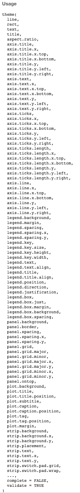

```{r setup, include=FALSE}
knitr::opts_chunk$set(echo = FALSE,
                      warning = FALSE,
                      message = FALSE)
options(htmltools.dir.version = FALSE)
options(width=110)
options(digits = 4)
require(tidyverse)
library(ggthemes)
baselers <- readr::read_csv("1_Data/basel.csv")
source("../baselink.R")

```
---
<p align="center">
<br>

<br>
<font style="font-size:10px">from <a href="http://r-statistics.co/Top50-Ggplot2-Visualizations-MasterList-R-Code.html">r-statistics.co</a></font>
</p>

---

# Modulare Graphiken in <mono>ggplot2</mono>

.pull-left45[

<ul>
  <li class="m1"><span><high>data</high>: Der Datensatz</span></li>
  <li class="m2"><span><high>mapping</high>: Grobe Struktur des Plots</span></li>
  <ul class="level">
    <li><span>Was soll auf die Achsen?</span></li>
    <li><span>Was soll Grösse/Farbe repräsentieren?</span></li>
  </ul>
  <li class="m3"><span><high>geoms</high>: Objekte im Plot</high></span></li>
  <li class="m4"><span><high>labs</high>: Annotierung des Plots</high></span></li>
  <li class="m5"><span><high>themes</high>: Ästhetische Gestaltung</high></span></li>
  <li class="m6"><span><high>facets</high>: Auftrennung des Plots </high></span></li>
  <li class="m7"><span><high>scales</high>: Skalierung der Achsen</high></span></li>
</ul>

]


.pull-right45[

```{r, echo = FALSE, fig.width = 7, fig.height = 5.5}
goal = ggplot(data = mpg, mapping = aes(x = displ, y = hwy, color = class)) +
  geom_point(size = 3, alpha = .9) + 
  geom_smooth(col = "blue", method = "lm")+
  labs(x = "Hubraum in Litern",
       y = "Autobahn Meilen pro Gallone",
       title = "MPG Datensatz",
       subtitle = "Autos mit mehr Hubraum fahren weniger Meilen pro Gallone",
       caption = "Quelle: mpg Datensatz in ggplot2") + 
  theme_bw()
goal
```

]


---

# Wir kreieren diesen Plot

.pull-left45[

<ul>
  <li class="m1"><span><high>data</high></span></li>
  <ul class="level">
    <li><span>Der <mono>mpg</mono> Datensatz</span></li>
  </ul>
  <li class="m2"><span><high>mapping</high></span></li>
  <ul class="level">
    <li><span>Hubraum auf die x-Achse</span></li>
    <li><span>Meilen pro Gallone auf die y-Achse</span></li>
    <li><span>Farbe der Objekte gemäss Autoklasse</span></li>
  </ul>
  <li class="m3"><span><high>geoms</high></span></li>
  <ul class="level">
    <li><span>Daten als Punkte</span></li>
    <li><span>Ergänze Regressionslinie</span></li>
  </ul>
  <li class="m4"><span><high>labs</high></span></li>
  <ul class="level">
    <li><span>Beschriftungen Achsen und Titel</span></li>
  </ul>
  <li class="m5"><span><high>themes</high></span></li>
  <ul class="level">
    <li><span>Schwarz-weiss Ästhetik</span></li>
  </ul>
  
</ul>

]


.pull-right45[

```{r, echo = FALSE, fig.width = 7, fig.height = 5.5}
goal
```


]


---

# `ggplot()`


.pull-left45[

<ul>
  <li class="m1"><span>Alle Plots beginnen mit <highm>ggplot()</highm></span></li>
  <li class="m2"><span>2 zentrale Argumente</span></li>
  <ul class="level">
    <li><span><mono>data</mono> | Der Datensatz (<mono>tibble</mono>)</span></li>
    <li><span><mono>mapping</mono> | Die Struktur definiert mittels <mono>aes()</mono>
  </ul>
  </span></li>
</ul>
]


.pull-right45[

```{r, fig.width = 7, fig.height = 5.5}
ggplot(data = mpg)
```

]


---

# `aes()`


.pull-left45[

<ul>
  <li class="m1"><span><highm>aes()</highm> definiert die Struktur für das <mono>mapping</mono> Argument.</span></li>
  <li class="m2"><span>Zentrale Argumente:</span></li>
  <ul class="level">
    <li><span><mono>x,y</mono> | Bestimmt die Achsen</span></li>
    <li><span><mono>color,fill</mono> | Bestimmt Farben</span></li>
    <li><span><mono>alpha</mono> | Bestimmt Transparenz</span></li>
    <li><span><mono>size</mono> | Bestimmt Grössen</span></li>
    <li><span><mono>shape</mono> | Bestimmt Objektypen (z.B. Kreise oder Quadrate)</span></li>
  </ul>
</ul>

]

.pull-right45[

```{r, fig.width = 6, fig.height = 4.5}
ggplot(data = mpg,
       mapping = aes(x = displ, y = hwy))
```

]

---

# <mono>+</mono>

.pull-left45[

<ul>
  <li class="m1"><span>Der <highm>+</highm> Operator erweitert den Plot um beliebige weitere Plotelemente.</span></li>
</ul>

<br>

```{r, eval = FALSE, fig.width = 5, fig.height = 4, out.width = "90%"}
ggplot(data = mpg,
       mapping = aes(x = displ,
                     y = hwy)) + 
  
  # Plotte Daten als Punkte
  geom_point() 
```

]


.pull-right45[


```{r, echo = FALSE, fig.width = 7, fig.height = 5.5}
ggplot(data = mpg,
       mapping = aes(x = displ, y = hwy)) + 
  geom_point()
```


]


---

# `geom_*()`

.pull-left45[

<ul>
  <li class="m1"><span><highm>geom_*()</highm> Funktionen definieren die geometrischen Objekte mit denen die Daten repräsentiert werden.</span></li>
  <li class="m2"><span>Eine Auswahl:</li>
  <ul class="level">
    <li><span><mono>geom_point()</mono> | für Punkte</span></li>
    <li><span><mono>geom_bar()</mono> | für Balken</span></li>
    <li><span><mono>geom_boxplot()</mono> | für Box-Plots </span></li>
    <li><span><mono>geom_count()</mono> | für Punkte skaliert nach Häufigkeit</span></li>
    <li><span><mono>geom_smooth()</mono> | für Kurven</span></li>
  </ul>
</ul>

]

.pull-right45[

```{r, echo = FALSE, fig.width = 7, fig.height = 5.5}
ggplot(data = mpg,
       mapping = aes(x = displ, y = hwy)) + 
  geom_point()
```


]


---


.pull-left45[

<br>
## `geom_count()`
<br>

```{r, out.width= "100%", echo = TRUE, fig.width = 6, fig.height = 4}
ggplot(data = mpg,
  mapping = aes(x = displ, y = hwy)) + 
  geom_count()
```


]

.pull-right45[

<br>
## `geom_bar()`
<br>

```{r, out.width= "100%", echo = TRUE, fig.width = 6, fig.height = 4}
ggplot(data = mpg,
  mapping = aes(x = class)) + 
  geom_bar()
```

]


---

.pull-left45[

<br>
## `geom_boxplot()`
<br>

```{r, fig.width = 6, fig.height = 4}
ggplot(data = mpg,
  mapping = aes(x = class,
                y = hwy)) + 
  geom_boxplot()
```

]


.pull-right45[

<br>
## `geom_violin()`
<br>

```{r, out.width= "100%", fig.width = 6, fig.height = 4}
ggplot(data = mpg,
  mapping = aes(x = class,
                y = hwy)) + 
  geom_violin()
```

]

---

# Was fehlt?

.pull-left45[

```{r, fig.width = 7, fig.height = 5.5, echo = F}
ggplot(data = mpg,
       mapping = aes(x = displ, 
                     y = hwy)) + 
  geom_point()
```

]


.pull-right45[

```{r, fig.width = 7, fig.height = 5.5, echo = FALSE}
goal
```

]


---

# `aes()`


.pull-left45[

<ul>
  <li class="m1"><span><highm>aes()</highm> definiert die Struktur für das <mono>mapping</mono> Argument.</span></li>
  <li class="m2"><span>Zentrale Argumente:</span></li>
  <ul class="level">
    <li><span><mono>x,y</mono> | Bestimmt die Achsen</span></li>
    <li><span><high><mono>color,fill</mono> | Bestimmt Farben</high></span></li>
  </ul>
</ul>


```{r, fig.width = 6, fig.height = 4.5, eval = F}
ggplot(data = mpg,
       mapping = aes(x = displ, 
                     y = hwy,
                     
                     # Farbe gemäss Klasse
                     color = class)) +
  geom_point()
```


]

.pull-right45[

```{r, fig.width = 7, fig.height = 5.5, echo = F}
ggplot(data = mpg,
       mapping = aes(x = displ, 
                     y = hwy,
                     
                     # Farbe gemäss Klasse
                     color = class)) +
  geom_point()
```

]

---

# Was fehlt?

.pull-left45[

```{r, fig.width = 7, fig.height = 5.5, echo = F}
ggplot(data = mpg,
       mapping = aes(x = displ, 
                     y = hwy,
                     color = class)) + 
  geom_point()
```

]


.pull-right45[

```{r, fig.width = 7, fig.height = 5.5, echo = FALSE}
goal
```

]

---

# `geom_smooth()`

.pull-left45[

<ul>
  <li class="m1"><span>Mit <highm>geom_smooth()</highm> können Kurven an die Daten angepasst werden.</span></li>
  <li class="m2"><span>Zentrale Argumente:</span></li>
  <ul class="level">
    <li><span><mono>method</mono> | Art der Datenanpassung</span></li>
    <li><span><mono>color</mono> | Farbe</high></span></li>
  </ul>

</ul>

```{r, fig.width = 7, fig.height = 5.5, eval = F}
ggplot(data = mpg, 
       mapping = aes(x = displ, y = hwy,
                     col = class)) +
  geom_point() + 
  
  # Ergänze Kurve
  geom_smooth(col = "blue")
```

]

.pull-right45[


```{r, fig.width = 7, fig.height = 5.5, echo = F}
ggplot(data = mpg, 
       mapping = aes(x = displ, y = hwy,
                     col = class)) +
  geom_point() + 
  geom_smooth(col = "blue")
```

]

---

# `geom_smooth()`

.pull-left45[

<ul>
  <li class="m1"><span>Mit <highm>geom_smooth()</highm> können angepasste Kurven ergänzt werden.</span></li>
  <li class="m2"><span>Zentrale Argumente:</span></li>
  <ul class="level">
    <li><span><mono>method</mono> | Art der Datenanpassung</span></li>
    <li><span><mono>color</mono> | Farbe</high></span></li>
  </ul>
</ul>

```{r, fig.width = 7, fig.height = 5.5, eval = F}
ggplot(data = mpg, 
       mapping = aes(x = displ, y = hwy,
                     col = class)) +
  geom_point() + 
  
  # Ergänze Kurve
  geom_smooth(col = "blue",
              method = "lm")
```

]

.pull-right45[


```{r, fig.width = 7, fig.height = 5.5, echo = F}
ggplot(data = mpg, 
       mapping = aes(x = displ, y = hwy, col = class)) +
  geom_point() + 
  geom_smooth(col = "blue",
              method = "lm")
```

]

---

# Vererbung

.pull-left45[

<ul>
  <li class="m1"><span><highm>geom</highm>s erben ihre Eigenschaften von <mono>mapping</mono>.</span></li>
  <li class="m2"><span>Vererbte Eigenschaften können durch eigene Argumente <high>überschrieben</high> werden.</span></li>
</ul>


```{r, fig.width = 7, fig.height = 5.5, eval = F}
ggplot(data = mpg, 
       mapping = aes(x = displ, y = hwy,
                     col = class)) +
  geom_point() + 
  geom_smooth() 
```

]

.pull-right45[

<p align="center">
<br>

<br>
<font style="font-size:10px">from <a href="http://catchingfire.ca/the-power-of-a-question-mark/">catchingfire.ca</a></font>
</p>
]

---

# Was fehlt?

.pull-left45[

```{r, fig.width = 7, fig.height = 5.5, echo = F}
ggplot(data = mpg, 
       mapping = aes(x = displ, y = hwy, col = class)) +
  geom_point() + 
  geom_smooth(col = "blue",
              method = "lm")
```

]


.pull-right45[

```{r, fig.width = 7, fig.height = 5.5, echo = FALSE}
goal
```

]

---

# `labs()`

.pull-left45[

<ul>
  <li class="m1"><span>Mit <highm>labs()</highm> können alle Aspekte des Plots annotiert werden.</span></li>
  <li class="m2"><span>Zentrale Argumente:</span></li>
  <ul class="level">
    <li><span><mono>x,y</mono> | Achsenbeschriftung</span></li>
    <li><span><mono>title, subtitle</mono> | Titel und Untertitel</high></span></li>
    <li><span><mono>caption</mono> | Bildunterschrift</high></span></li>
  </ul>
</ul>

```{r, echo = TRUE, eval = FALSE}
ggplot(...) +
  labs(x = "Hubraum in Litern",
       y = "Autobahn Meilen pro Gallone",
       title = "MPG Datensatz",
       subtitle = "Autos mit mehr Hub...",
       caption = "Quelle: mpg Datensatz...")
```

]


.pull-right45[

```{r, echo = FALSE, fig.width = 7, fig.height = 5.5}
ggplot(data = mpg, mapping = aes(x = displ, y = hwy, color = class)) +
  geom_point(size = 3, alpha = .9) + 
  geom_smooth(col = "blue", method = "lm") +
  labs(x = "Hubraum in Litern",
       y = "Autobahn Meilen pro Gallone",
       title = "MPG Datensatz",
       subtitle = "Autos mit mehr Hubraum fahren weniger Meilen pro Gallone",
       caption = "Quelle: mpg Datensatz in ggplot2") 
```

]


---

# Was fehlt?

.pull-left45[

```{r, fig.width = 7, fig.height = 5.5, echo = F}
ggplot(data = mpg, 
       mapping = aes(x = displ, y = hwy, col = class)) +
  geom_point() + 
  geom_smooth(col = "blue",
              method = "lm") +
  labs(x = "Hubraum in Litern",
       y = "Autobahn Meilen pro Gallone",
       title = "MPG Datensatz",
       subtitle = "Autos mit mehr Hubraum fahren weniger Meilen pro Gallone",
       caption = "Quelle: mpg Datensatz in ggplot2") 
```

]


.pull-right45[

```{r, fig.width = 7, fig.height = 5.5, echo = FALSE}
goal
```

]

---

# Formatierung mit `theme_*()`

.pull-left45[

<ul>
  <li class="m1"><span>Mit <highm>theme()</highm> können alle Aspekte eines Plots mit einem vorgefertigten Satz an Einstellungen ästhetisch formatiert werden.</span></li>
  <li class="m2"><span>Einige <mono>theme</mono>s:</span></li>
  <ul class="level">
    <li><span><mono>theme_gray()</mono></span></li>
    <li><span><mono>theme_classic()</mono></span></li>
    <li><span><mono>theme_void()</mono></span></li>
    <li><span><mono>theme_excel() (<mono>ggthemes</mono>)</mono></span></li>
    <li><span><mono>theme_economist() (<mono>ggthemes</mono>)</mono></span></li>
    <li><span><mono>theme_bw()</mono></span></li>
  </ul>
</ul>

]

.pull-right45[

```{r, eval = F}
ggplot(...) + theme_gray()
```

```{r, fig.width = 7, fig.height = 5.5, echo = FALSE}
goal + theme_gray()
```

]

---

# Formatierung mit `theme_*()`

.pull-left45[

<ul>
  <li class="m1"><span>Mit <highm>theme()</highm> können alle Aspekte eines Plots mit einem vorgefertigten Satz an Einstellungen ästhetisch formatiert werden.</span></li>
  <li class="m2"><span>Einige <mono>theme</mono>s:</span></li>
  <ul class="level">
    <li><span><mono>theme_gray()</mono></span></li>
    <li><span><mono>theme_classic()</mono></span></li>
    <li><span><mono>theme_void()</mono></span></li>
    <li><span><mono>theme_excel() (<mono>ggthemes</mono>)</mono></span></li>
    <li><span><mono>theme_economist() (<mono>ggthemes</mono>)</mono></span></li>
    <li><span><mono>theme_bw()</mono></span></li>
  </ul>
</ul>

]

.pull-right45[

```{r, eval = F}
ggplot(...) + theme_classic()
```

```{r, fig.width = 7, fig.height = 5.5, echo = FALSE}
goal + theme_classic()
```

]

---

# Formatierung mit `theme_*()`

.pull-left45[

<ul>
  <li class="m1"><span>Mit <highm>theme()</highm> können alle Aspekte eines Plots mit einem vorgefertigten Satz an Einstellungen ästhetisch formatiert werden.</span></li>
  <li class="m2"><span>Einige <mono>theme</mono>s:</span></li>
  <ul class="level">
    <li><span><mono>theme_gray()</mono></span></li>
    <li><span><mono>theme_classic()</mono></span></li>
    <li><span><mono>theme_void()</mono></span></li>
    <li><span><mono>theme_excel() (<mono>ggthemes</mono>)</mono></span></li>
    <li><span><mono>theme_economist() (<mono>ggthemes</mono>)</mono></span></li>
    <li><span><mono>theme_bw()</mono></span></li>
  </ul>
</ul>

]

.pull-right45[

```{r, eval = F}
ggplot(...) + theme_void()
```

```{r, fig.width = 7, fig.height = 5.5, echo = FALSE}
goal + theme_void()
```

]

---

# Formatierung mit `theme_*()`

.pull-left45[

<ul>
  <li class="m1"><span>Mit <highm>theme()</highm> können alle Aspekte eines Plots mit einem vorgefertigten Satz an Einstellungen ästhetisch formatiert werden.</span></li>
  <li class="m2"><span>Einige <mono>theme</mono>s:</span></li>
  <ul class="level">
    <li><span><mono>theme_gray()</mono></span></li>
    <li><span><mono>theme_classic()</mono></span></li>
    <li><span><mono>theme_void()</mono></span></li>
    <li><span><mono>theme_excel() (<mono>ggthemes</mono>)</mono></span></li>
    <li><span><mono>theme_economist() (<mono>ggthemes</mono>)</mono></span></li>
    <li><span><mono>theme_bw()</mono></span></li>
  </ul>
</ul>

]

.pull-right45[

```{r, eval = F}
ggplot(...) + theme_excel()
```

```{r, fig.width = 7, fig.height = 5.5, echo = FALSE}
goal + theme_excel()
```

]

---

# Formatierung mit `theme_*()`

.pull-left45[

<ul>
  <li class="m1"><span>Mit <highm>theme()</highm> können alle Aspekte eines Plots mit einem vorgefertigten Satz an Einstellungen ästhetisch formatiert werden.</span></li>
  <li class="m2"><span>Einige <mono>theme</mono>s:</span></li>
  <ul class="level">
    <li><span><mono>theme_gray()</mono></span></li>
    <li><span><mono>theme_classic()</mono></span></li>
    <li><span><mono>theme_void()</mono></span></li>
    <li><span><mono>theme_excel() (<mono>ggthemes</mono>)</mono></span></li>
    <li><span><mono>theme_economist() (<mono>ggthemes</mono>)</mono></span></li>
    <li><span><mono>theme_bw()</mono></span></li>
  </ul>
</ul>

]

.pull-right45[

```{r, eval = F}
ggplot(...) + theme_economist()
```

```{r, fig.width = 7, fig.height = 5.5, echo = FALSE}
goal + theme_economist()
```

]

---

# Formatierung mit `theme_*()`

.pull-left45[

<ul>
  <li class="m1"><span>Mit <highm>theme()</highm> können alle Aspekte eines Plots mit einem vorgefertigten Satz an Einstellungen ästhetisch formatiert werden.</span></li>
  <li class="m2"><span>Einige <mono>theme</mono>s:</span></li>
  <ul class="level">
    <li><span><mono>theme_gray()</mono></span></li>
    <li><span><mono>theme_classic()</mono></span></li>
    <li><span><mono>theme_void()</mono></span></li>
    <li><span><mono>theme_excel() (<mono>ggthemes</mono>)</mono></span></li>
    <li><span><mono>theme_economist() (<mono>ggthemes</mono>)</mono></span></li>
    <li><span><mono>theme_bw()</mono></span></li>
  </ul>
  </span></li>
</ul>

]

.pull-right45[

```{r, eval = F}
ggplot(...) + theme_bw()
```

```{r, fig.width = 7, fig.height = 5.5, echo = FALSE}
goal + theme_bw()
```

]


---

# Et voila!

.pull-left45[

```{r, fig.width = 7, fig.height = 5.5, eval = F, echo = TRUE}
ggplot(data = mpg, 
       mapping = aes(x = displ, y = hwy, 
                     col = class)) +
  geom_point() + 
  geom_smooth(col = "blue", 
              method = "lm")+
  labs(
    x = "Hubraum in Litern",
    y = "Autobahn Meilen pro Gallone",
    title = "MPG Datensatz",
    subtitle = "Autos mit mehr Hub...",
    caption = "Quelle: mpg Datensatz...") + 
  theme_bw()

```

]


.pull-right45[

```{r, fig.width = 7, fig.height = 5.5, echo = FALSE}
goal
```

]

---

# Plots anpassen

.pull-left45[

<ul>
  <li class="m1"><span>Kreiere und verändere ein <highm>gg</highm> Plot-Objekt.</span></li>
  <li class="m2"><span>Teile den Plot auf mit <highm>facet</highm>s</span></li>
  <li class="m3"><span>Nutze <highm>theme</highm>s um einzelne Aspekte des Plots zu formatieren</span></li>
  <li class="m4"><span>Kreiere deine eigenen <highm>theme</highm>s.</span></li>
  <li class="m5"><span>Speichere deinen Plot als <highm>.pdf</highm> oder <highm>.png</highm>.</span></li>
</ul>

]


.pull-right45[

<p align="center">
<br>
<font style="font-size:10px">from <a href="http://www.lonniemillsap.com/?p=1779">lonniemillsap.com</a></font>
</p>

]


---

# Das <mono>gg</mono> Objekt

.pull-left45[

<ul>
  <li class="m1"><span>Die <mono>ggplot</mono> generiert ein <high><mono>gg</mono> Objekt</high>, dass gespeichert werden kann.</span></li>
  <li class="m2"><span><mono>gg</mono> Objekte können durch <mono>+</mono> beliebig <high>verändert/erweitert</high> werden</span></li>
  <li class="m3"><span>Ausführen des Objekts generiert den Plot.</span></li>
</ul>

```{r, fig.width = 8}
# Weise Plot Objekt zu
mein_plot <- ggplot(data = mpg,
                    aes(x = displ,y = hwy)) + 
  geom_point() + theme_bw()

# Zeige Klasse
class(mein_plot)
```

]

.pull-right45[

```{r, fig.width = 7, fig.height = 5.5}
mein_plot 
```

]

---

# Das <mono>gg</mono> Objekt

.pull-left45[

<ul>
  <li class="m1"><span>Die <mono>ggplot</mono> generiert ein <high><mono>gg</mono> Objekt</high>, dass gespeichert werden kann.</span></li>
  <li class="m2"><span><mono>gg</mono> Objekte können durch <mono>+</mono> beliebig <high>verändert/erweitert</high> werden</span></li>
  <li class="m3"><span>Ausführen des Objekts generiert den Plot.</span></li>
</ul>

```{r, fig.width = 8}
# Weise Plot Objekt zu
mein_plot <- ggplot(data = mpg,
                    aes(x = displ,y = hwy)) + 
  geom_point() + theme_bw()

# Zeige Klasse
class(mein_plot)
```

]

.pull-right45[

```{r, fig.width = 7, fig.height = 5.5}
mein_plot + geom_smooth()
```

]


---

# `facet_*()`

.pull-left45[

<ul>
  <li class="m1"><span>Facetting kreiert <high>denselben Plot für Gruppen</high> definiert durch dritte Variablen.</span></li>
  <li class="m2"><span>Facet Funktionen:</span></li>
  <ul class="level">
    <li><span><mono>facet_wrap()</mono></span></li>
    <li><span><mono>facet_grid()</mono></span></li>
  </ul>
</ul>

```{r, fig.width = 7, fig.height = 5.5, echo = TRUE, eval = F}
# Ohne facetting
ggplot(data = mpg, 
       mapping = aes(x = displ, 
                     y = hwy)) + 
  geom_point() + theme_bw()
```

]

.pull-right45[

```{r, fig.width = 7, fig.height = 5.5, echo = FALSE}
# Ohne facetting
ggplot(data = mpg, 
       mapping = aes(x = displ, 
                     y = hwy)) + 
  geom_point() + theme_bw()
```

]

---

# `facet_wrap()`

.pull-left45[

<ul>
  <li class="m1"><span>Facetting kreiert <high>denselben Plot für Gruppen</high> definiert durch dritte Variablen.</span></li>
  <li class="m2"><span>Facet Funktionen:</span></li>
  <ul class="level">
    <li><span><mono>facet_wrap()</mono></span></li>
    <li><span><mono>facet_grid()</mono></span></li>
  </ul>
</ul>

```{r, fig.width = 7, fig.height = 5.5, echo = TRUE, eval = F}
# Ohne facetting
ggplot(data = mpg, 
       mapping = aes(x = displ, 
                     y = hwy)) + 
  geom_point() + theme_bw() +
  facet_wrap(~ class)
```

]

.pull-right45[

```{r, fig.width = 7, fig.height = 5.5, echo = FALSE}
# Mit faceting
ggplot(data = mpg, 
       mapping = aes(x = displ, 
                     y = hwy)) + 
  geom_point() + theme_bw() +
  facet_wrap(~ class)
```

]

---

# `facet_grid()`

.pull-left45[

<ul>
  <li class="m1"><span>Facetting kreiert <high>denselben Plot für Gruppen</high> definiert durch dritte Variablen.</span></li>
  <li class="m2"><span>Facet Funktionen:</span></li>
  <ul class="level">
    <li><span><mono>facet_wrap()</mono></span></li>
    <li><span><mono>facet_grid()</mono></span></li>
  </ul>
</ul>

```{r, fig.width = 7, fig.height = 5.5, echo = TRUE, eval = F}
# Ohne facetting
ggplot(data = mpg, 
       mapping = aes(x = displ, 
                     y = hwy)) + 
  geom_point() + theme_bw() +
  facet_grid(drv ~ class) 
```

]

.pull-right45[

```{r, fig.width = 7, fig.height = 5.5, echo = FALSE}
# Mit facetting
ggplot(data = mpg, 
       mapping = aes(x = displ, 
                     y = hwy)) + 
  geom_point() + theme_bw() +
  facet_grid(drv ~ class) 
```

]


---

# `theme()`

.pull-left45[

<ul>
  <li class="m1"><span>Passt mit den <high>94 Argumenten von <mono>theme()</mono></high> alle ästhetischen Aspekte deines Plots an.</span></li>
  <li class="m2"><span>Nutze hierzu vier Helferfunktionen:</span></li>
  <ul class="level">
    <li><span><mono>element_rect()</mono> | für Flächen</span></li>
    <li><span><mono>element_line()</mono> | für Linien</span></li>
    <li><span><mono>element_text()</mono> | für Text</span></li>
    <li><span><mono>element_blank()</mono> | zum entfernen</span></li>
  </ul>
</ul>

```{r, eval = F}
# Verwendung von theme
mein_plot + 
  theme(argument = element_*(), 
        argument = element_*(),
        ...)
```

]


.pull-right45[

<p align="center">

</p>
]

---

# Hintergrund

.pull-left45[

<ul>
  <li class="m1"><span>Argumente für den Hintergrund:</span></li>
  <ul class="level">
    <li><span><mono>panel.background</mono> | für den inneren Hintergrund</span></li>
    <li><span><mono>plot.background</mono> | für den äusseren Hintergrund</span></li>
  </ul>
</ul>

```{r, eval = F}
# Ändere den Hintergrund
mein_plot + 
  theme(
    panel.background = 
      element_rect(fill = 'tomato'), 
    plot.background = 
      element_rect(fill = 'burlywood'))
```

]


.pull-right45[

```{r, fig.width = 7, fig.height = 5.5, echo = FALSE}
# Ändere den Hintergrund
mein_plot = mein_plot + 
  theme(
    panel.background = element_rect(fill = 'tomato'), 
    plot.background = element_rect(fill = 'burlywood'))
mein_plot
```

]

---

# Raster

.pull-left45[

<ul>
  <li class="m1"><span>Argumente für das Raster:</span></li>
  <ul class="level">
    <li><span><mono>panel.grid.major</mono> | grössere Rasterlinien</span></li>
    <li><span><mono>panel.grid.minor</mono> | kleinere Rasterlinien</span></li>
  </ul>
</ul>

```{r, eval = F}
# Ändere das Raster
mein_plot + 
  theme(
    panel.grid.major = 
      element_line(colour = "salmon"),
    panel.grid.minor = 
      element_line(colour = "seagreen"))
```

]


.pull-right45[

```{r, fig.width = 7, fig.height = 5.5, echo = FALSE}
# Ändere das Raster
mein_plot = mein_plot + 
  theme(
    panel.grid.major = 
      element_line(colour = "salmon"),
    panel.grid.minor = 
      element_line(colour = "seagreen")
    )
mein_plot
```

]

---

# Raster

.pull-left45[

<ul>
  <li class="m1"><span>Argumente für das Raster:</span></li>
  <ul class="level">
    <li><span><mono>panel.grid.major</mono> | grössere Rasterlinien</span></li>
    <li><span><mono>panel.grid.minor</mono> | kleinere Rasterlinien</span></li>
  </ul>
</ul>

```{r, eval = F}
# Ändere das Raster
mein_plot + 
  theme(
    panel.grid.major = 
      element_line(colour = "salmon",
                   size = 3),
    panel.grid.minor = 
      element_line(colour = "seagreen",
                   size = 1.5))

```

]


.pull-right45[

```{r, fig.width = 7, fig.height = 5.5, echo = FALSE}
# Ändere das Raster
mein_plot = mein_plot + 
  theme(
    panel.grid.major = 
      element_line(colour = "salmon",
                   size = 3),
    panel.grid.minor = 
      element_line(colour = "seagreen",
                   size = 1.5)
    )
mein_plot
```

]

---

# Achsen

.pull-left45[

<ul>
  <li class="m1"><span>Argumente für die Achsen:</span></li>
  <ul class="level">
    <li><span><mono>axis.line.x</mono> | x-Achse</span></li>
    <li><span><mono>axis.line.y</mono> | y-Achse</span></li>
    <li><span><mono>axis.title.x</mono> | x-Achse Titel</span></li>
    <li><span><mono>axis.title.y</mono> | y-Achse Titel</span></li>
  </ul>
</ul>

```{r, eval = F}
# Ändere die Achsen
mein_plot + 
  theme(
    axis.line.x = 
      element_line(colour = "deeppink", 
                   size = 3.5, 
                   lineend = "butt"),
    axis.line.y = 
      element_line(colour = "deeppink", 
                   size = 3.5))

```

]


.pull-right45[

```{r, fig.width = 7, fig.height = 5.5, echo = FALSE}
# Ändere die Achsen
mein_plot = mein_plot + 
  theme(
    axis.line.x = 
      element_line(colour = "deeppink", 
                   size = 3.5, 
                   lineend = "butt"),
    axis.line.y = 
      element_line(colour = "deeppink", 
                   size = 3.5)
    )
mein_plot
```

]

---

# Achsen

.pull-left45[

<ul>
  <li class="m1"><span>Argumente für die Achsen:</span></li>
  <ul class="level">
    <li><span><mono>axis.line.x</mono> | x-Achse</span></li>
    <li><span><mono>axis.line.y</mono> | y-Achse</span></li>
    <li><span><mono>axis.title.x</mono> | x-Achse Titel</span></li>
    <li><span><mono>axis.title.y</mono> | y-Achse Titel</span></li>
  </ul>
</ul>

```{r, eval = F}
# change grid line color
mein_plot + 
  theme(
    axis.title.x = 
      element_text(family = "Comic Sans MS", 
                   size = 30),
    axis.title.y = 
      element_text(family = "Comic Sans MS", 
                   size = 30))

```

]

.pull-right45[

```{r, fig.width = 7, fig.height = 5.5, echo = FALSE}
# change grid line color
mein_plot = mein_plot + 
  theme(
    axis.line.x = 
      element_line(colour = "deeppink", 
                   size = 3.5, 
                   lineend = "butt"),
    axis.line.y = 
      element_line(colour = "deeppink", 
                   size = 3.5),
    axis.title.x = 
      element_text(
                   family = "Comic Sans MS", 
                   size = 30),
    axis.title.y = 
      element_text(family = "Comic Sans MS", 
                   size = 30)
    )
mein_plot
```

]


---

.pull-left45[

# Weitere Argumente <font style="font-size:16px"> (unvollständig)</font>

<u><mono>theme()</mono></u>

<table style="width:100%">
  <tr>
    <td> <b>Argument</b> </td>
    <td> <b>Beschreibung</b> </td>
  </tr>
  <tr>
    <td> <mono>axis.title.*</mono> </td>
    <td> Alles betreffend Achsentitel </td>
  </tr>
  <tr>
    <td> <mono>axis.ticks.*</mono> </td>
    <td> Alles betreffend Achseneinteilungen </td>
  </tr>
  <tr>
    <td> <mono>axis.line.*</mono> </td>
    <td> Alles betreffend Achsenlinien </td>
  </tr>
  <tr>
    <td> <mono>legend.*</mono> </td>
    <td> Alles betreffend Legenden </td>
  </tr>
  <tr>
    <td> <mono>panel.*</mono> </td>
    <td> Alles betreffend die innere Plotregion </td>
  </tr>
  <tr>
    <td> <mono>plot.*</mono> </td>
    <td> Alles betreffend die äussere Plotregion </td>
  </tr>
  <tr>
    <td> <mono>strip.*</mono> </td>
    <td> Alles betreffend die Facet Titel </td>
  </tr>
</table>

]

.pull-right45[

<br>

<u><mono>element_rect()</mono></u>

<table style="width:100%">
  <tr>
    <td> <b>Argument</b> </td>
    <td> <b>Beschreibung</b> </td>
  </tr>
  <tr>
    <td> <mono>fill</mono> </td>
    <td> Füllfarbe </td>
  </tr>
  <tr>
    <td> <mono>colour</mono> </td>
    <td> Randfarbe </td>
  </tr>
</table>

<u><mono>element_line()</mono></u>

<table style="width:100%">
  <tr>
    <td> <b>Argument</b> </td>
    <td> <b>Beschreibung</b> </td>
  </tr>
  <tr>
    <td> <mono>size</mono> </td>
    <td> Liniengrösse </td>
  </tr>
  <tr>
    <td> <mono>linetype</mono> </td>
    <td> Art der Linie </td>
  </tr>
</table>

<u><mono>element_text()</mono></u>

<table style="width:100%">
  <tr>
    <td> <b>Argument</b> </td>
    <td> <b>Beschreibung</b> </td>
  </tr>
  <tr>
    <td> <mono>face</mono> </td>
    <td> Schriftart </td>
  </tr>
  <tr>
    <td> <mono>colour</mono> </td>
    <td> Schriftfarbe </td>
  </tr>
</table>

]


---

# Eigene themes

.pull-left45[

```{r}
mein_theme <- theme(
  panel.background = 
    element_rect(fill = 'tomato'), 
  plot.background = 
    element_rect(fill = 'burlywood'),
  panel.grid.major = element_line(
    colour = "salmon", size = 3),
  panel.grid.minor = element_line(
    colour = "seagreen", size = 1.5),
  axis.line.x = element_line(
    colour = "deeppink", size = 3.5, 
    lineend = "butt"),
  axis.line.y = element_line(
    colour = "deeppink", size = 3.5),
  axis.title.x = element_text(
    family = "Comic Sans MS", size = 30),
  axis.title.y = element_text(
    family = "Comic Sans MS", size = 30))
```

]

.pull-right45[

```{r, echo = F}
mein_plot <- ggplot(data = mpg,
                 aes(x = displ,
                     y = hwy)) + 
              geom_point() + 
              theme_bw()
```

```{r, fig.width = 7, fig.height = 5.5, echo = TRUE}
mein_plot
```

]

---

# Eigene themes

.pull-left45[

```{r}
mein_theme <- theme(
  panel.background = 
    element_rect(fill = 'tomato'), 
  plot.background = 
    element_rect(fill = 'burlywood'),
  panel.grid.major = element_line(
    colour = "salmon", size = 3),
  panel.grid.minor = element_line(
    colour = "seagreen", size = 1.5),
  axis.line.x = element_line(
    colour = "deeppink", size = 3.5, 
    lineend = "butt"),
  axis.line.y = element_line(
    colour = "deeppink", size = 3.5),
  axis.title.x = element_text(
    family = "Comic Sans MS", size = 30),
  axis.title.y = element_text(
    family = "Comic Sans MS", size = 30))
```

]

.pull-right45[

```{r, echo = F}
mein_plot <- ggplot(data = mpg,
                 aes(x = displ,
                     y = hwy)) + 
              geom_point() + 
              theme_bw()
```

```{r, fig.width = 7, fig.height = 5.5, echo = TRUE}
mein_plot + mein_theme
```

]

---

# Multiple Plots

.pull-left45[

<ul>
  <li class="m1"><span>Das <mono>patchwork</mono> Paket liefert eine einfache Syntax um Plots zu verknüpfen.</span></li>
  <li class="m2"><span><mono>patchwork</mono> Syntax:</span></li>
  <ul class="level">
    <li><span><mono>+</mono> | generisch zusammefügen</span></li>
    <li><span><mono>|</mono> | nebeneinander stellen</span></li>
    <li><span><mono>/</mono> | untereinander stellen</span></li>
    <li><span><mono>()</mono> | zusammenfassen</span></li>
    <li><span><mono>&</mono> | auf alle anwenden</span></li>
  </ul>
</ul>

```{r, echo = F}
mein_plot <- ggplot(data = mpg,
                 aes(x = displ,
                     y = hwy)) + 
              geom_point() + 
              theme_bw()

require(patchwork)
```

<br>

```{r, fig.width = 7, fig.height = 5.5, echo = TRUE}
# Speichere plots
schoen <- mein_plot
unschoen <- mein_plot + mein_theme
```

]

.pull-right45[

```{r, fig.width = 7, fig.height = 5.5, echo = TRUE}
schoen + unschoen
```

]

---

# Multiple Plots

.pull-left45[

<ul>
  <li class="m1"><span>Das <mono>patchwork</mono> Paket liefert eine einfache Syntax um Plots zu verknüpfen.</span></li>
  <li class="m2"><span><mono>patchwork</mono> Syntax:</span></li>
  <ul class="level">
    <li><span><mono>+</mono> | generisch zusammefügen</span></li>
    <li><span><mono>|</mono> | nebeneinander stellen</span></li>
    <li><span><mono>/</mono> | untereinander stellen</span></li>
    <li><span><mono>()</mono> | zusammenfassen</span></li>
    <li><span><mono>&</mono> | auf alle anwenden</span></li>
  </ul>
</ul>

```{r, echo = F}
mein_plot <- ggplot(data = mpg,
                 aes(x = displ,
                     y = hwy)) + 
              geom_point() + 
              theme_bw()

require(patchwork)
```

<br>

```{r, fig.width = 7, fig.height = 5.5, echo = TRUE}
# Speichere plots
schoen <- mein_plot
unschoen <- mein_plot + mein_theme
```

]

.pull-right45[

```{r, fig.width = 7, fig.height = 5.5, echo = TRUE}
schoen | unschoen + schoen
```

]

---

# Multiple Plots

.pull-left45[

<ul>
  <li class="m1"><span>Das <mono>patchwork</mono> Paket liefert eine einfache Syntax um Plots zu verknüpfen.</span></li>
  <li class="m2"><span><mono>patchwork</mono> Syntax:</span></li>
  <ul class="level">
    <li><span><mono>+</mono> | generisch zusammefügen</span></li>
    <li><span><mono>|</mono> | nebeneinander stellen</span></li>
    <li><span><mono>/</mono> | untereinander stellen</span></li>
    <li><span><mono>()</mono> | zusammenfassen</span></li>
    <li><span><mono>&</mono> | auf alle anwenden</span></li>
  </ul>
</ul>

```{r, echo = F}
mein_plot <- ggplot(data = mpg,
                 aes(x = displ,
                     y = hwy)) + 
              geom_point() + 
              theme_bw()

require(patchwork)
```

<br>

```{r, fig.width = 7, fig.height = 5.5, echo = TRUE}
# Speichere plots
schoen <- mein_plot
unschoen <- mein_plot + mein_theme
```

]

.pull-right45[

```{r, fig.width = 7, fig.height = 5.5, echo = TRUE}
(schoen+schoen) / (schoen+schoen)
```

]

---

# Multiple Plots

.pull-left45[

<ul>
  <li class="m1"><span>Das <mono>patchwork</mono> Paket liefert eine einfache Syntax um Plots zu verknüpfen.</span></li>
  <li class="m2"><span><mono>patchwork</mono> Syntax:</span></li>
  <ul class="level">
    <li><span><mono>+</mono> | generisch zusammefügen</span></li>
    <li><span><mono>|</mono> | nebeneinander stellen</span></li>
    <li><span><mono>/</mono> | untereinander stellen</span></li>
    <li><span><mono>()</mono> | zusammenfassen</span></li>
    <li><span><mono>&</mono> | auf alle anwenden</span></li>
  </ul>
</ul>

```{r, echo = F}
mein_plot <- ggplot(data = mpg,
                 aes(x = displ,
                     y = hwy)) + 
              geom_point() + 
              theme_bw()

require(patchwork)
```

<br>

```{r, fig.width = 7, fig.height = 5.5, echo = TRUE}
# Speichere plots
schoen <- mein_plot
unschoen <- mein_plot + mein_theme
```

]

.pull-right45[

```{r, fig.width = 7, fig.height = 5.5, echo = TRUE}
(schoen+schoen) / (schoen+schoen) &
  mein_theme
```

]

---

# Multiple Plots

.pull-left45[

<ul>
  <li class="m1"><span>Das <mono>patchwork</mono> Paket liefert eine einfache Syntax um Plots zu verknüpfen.</span></li>
  <li class="m2"><span><mono>patchwork</mono> Syntax:</span></li>
  <ul class="level">
    <li><span><mono>+</mono> | generisch zusammefügen</span></li>
    <li><span><mono>|</mono> | nebeneinander stellen</span></li>
    <li><span><mono>/</mono> | untereinander stellen</span></li>
    <li><span><mono>()</mono> | zusammenfassen</span></li>
    <li><span><mono>&</mono> | auf alle anwenden</span></li>
  </ul>
</ul>

```{r, echo = F}
mein_plot <- ggplot(data = mpg,
                 aes(x = displ,
                     y = hwy)) + 
              geom_point() + 
              theme_bw()

require(patchwork)
```

<br>

```{r, fig.width = 7, fig.height = 5.5, echo = TRUE}
# Speichere plots
schoen <- mein_plot
unschoen <- mein_plot + mein_theme
```

]

.pull-right45[

```{r, fig.width = 7, fig.height = 5.5, echo = TRUE}
(schoen+schoen) / (schoen+schoen) +
  plot_annotation(tag_levels = "A") & 
  theme(legend.position = "none") 
```

]

---

# `ggsave()`

.pull-left45[

<ul>
  <li class="m1"><span>Kreiere <high>Bilddateien</high> mit <mono>ggsave()</mono>.</span></li>
  <li class="m2"><span><mono>ggsave</mono> Argumente:</span></li>
  <ul class="level">
    <li><span><mono>filename</mono> | Dateipfad</span></li>
    <li><span><mono>device</mono> | z.B. <mono>".pdf"</mono> oder <mono>".png"</mono></span></li>
    <li><span><mono>path</mono> | Pfad zum Ordner</span></li>
    <li><span><mono>height, width</mono> | Höhe, Breite</span></li>
    <li><span><mono>unit</mono> | Einheit für Höhe, Breite</span></li>
    <li><span><mono>dpi</mono> | Auflösung pro Einheit</span></li>
  </ul>
</ul>

]


.pull-right45[

```{r, eval = FALSE}
# Kreiere meinen Plot
mein_plot <- ggplot(data = mpg,
                 aes(x = displ, y = hwy)) + 
            geom_point() + 
            mytheme

# Kreiere "mein_plot.pdf"
ggsave(filename = "mein_plot",
       plot = mein_plot,
       device = "pdf",
       path = "figures",
       width = 6, 
       height = 4)
```

]

---

# `ggsave()`

.pull-left45[

<ul>
  <li class="m1"><span>Kreiere <high>Bilddateien</high> mit <mono>ggsave()</mono>.</span></li>
  <li class="m2"><span><mono>ggsave</mono> Argumente:</span></li>
  <ul class="level">
    <li><span><mono>filename</mono> | Dateipfad</span></li>
    <li><span><mono>device</mono> | z.B. <mono>".pdf"</mono> oder <mono>".png"</mono></span></li>
    <li><span><mono>path</mono> | Pfad zum Ordner</span></li>
    <li><span><mono>height, width</mono> | Höhe, Breite</span></li>
    <li><span><mono>unit</mono> | Einheit für Höhe, Breite</span></li>
    <li><span><mono>dpi</mono> | Auflösung pro Einheit</span></li>
  </ul>
</ul>

]


.pull-right45[

```{r, eval = FALSE}
# Kreiere meinen Plot
mein_plot <- ggplot(data = mpg,
                 aes(x = displ, y = hwy)) + 
            geom_point() + 
            mytheme

# Kreiere "mein_plot.png"
ggsave(filename = "mein_plot",
       plot = mein_plot,
       device = "png",
       path = "figures",
       width = 6, 
       height = 4)
```

]


---

class: middle, center

<h1><a href="`r noquote(baselink)`_sessions/Plotting/Plotting_practical.html">Practical</a></h1>


