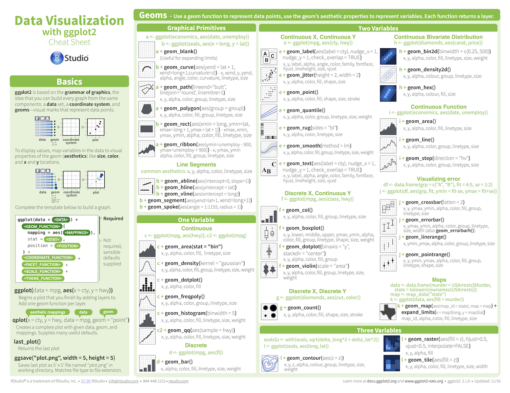

```{r setup, include=FALSE}
options(htmltools.dir.version = FALSE)
options(width = 110)
options(digits = 4)

knitr::opts_chunk$set(fig.align = 'center')
source("../baselink.R")
```
---
# Agenda und Material

.pull-left45[


<ul>
Klicke auf <high>"Start Advanced Datascience"</high> auf Ilias!
</ul>

]


.pull-right45[

<ul>
<iframe src="https://ads-hs2021.netlify.app/" width="500" height="500"></iframe>
</ul>  

]

---

# Ziel

.pull-left45[


###Das Ziel dieses Kurses ist Euch die eigenständige Konzeption, Umsetzung und Auswertung eines Data Science Projektes zu vermitteln bzw. Euch dabei zu begleiten.

]


.pull-right45[

<ul>
<p align="center"></p>

</ul>  

]
---

.pull-left4[

# Der Data Science Kreislauf

]

.pull-right6[
<br>
<p align = "center">
<br>
<font style="font-size:10px">from <a href="http://sudeep.co/">http://sudeep.co/</a></font>
</p>
]

---

# Ziel im Detail

.pull-left45[

<ul>
Daten sind im <high>Marketing</high> eine Ressource, die immer mehr an Wichtigkeit gewinnt. Das Ziel dieses Seminars ist es Fragen aus dem Marketing <high>datenbasiert</high> und <high>analytisch</high> zu beantworten. 
<br><br>
Der Kurs besteht aus <high>zwei Teilen</high>, einer <high>Wiederholung</high> von R Grundlagen und die <high>eigenständige</high> Ausarbeitung einer <high>Fragestellung</high>, deren <high>Beantwortung</high> und <high>Präsentation</high>. 
</ul>

]


.pull-right45[

<ul>
<p align="center"></p>

</ul>  

]

---

.pull-left45[

# Ablauf 

## Erster Teil

<ul>

  <li class="m1"><span><high>Wiederholung</high></span></li>
  <ul class="level">
    <li><span>Wrangling, Plotting</span></li>
    <li><span>Offene Fragen klären</span></li>
  </ul>
  <li class="m2"><span><high>Thematischer Input</high>
  <ul class="level">
    <li><span>Folien-basierten Einführung</span></li>
    <li><span>Code-Beispiele</span></li>
    <li><span>Live Demos</span></li>
  </ul>
  </span></li>

</ul>

]

.pull-right45[
<br><br><br><br>
## Zweiter Teil
<ul>
  <li class="m1"><span><high>Projektplanung</high></span></li>
  <ul class="level">
    <li><span>Fragestellung erarbeiten</span></li>
    <li><span>Datenquelle(n) definieren und Verfügbarkeit überprüfen</span></li>
    <li><span>Proposal schreiben</span></li>
  </ul>
  <li class="m2"><span><high>Projekt Umsetzung</high>
  <ul class="level">
    <li><span>Proposal präsentieren</span></li>
    <li><span>Beantwortung der Forschungsfrage(n)~</span></li>
    <li><span>Dokumentation der Analyse</span></li>
    <li><span>Projektpräsentation</span></li>
  </ul>
  </span></li>
]


---


.pull-left45[

# Erster Teil


<ul>
  <li class="m1"><span><high>Slide Input</high>
  <br><br>
  <ul class="level">
    <li><span>Theorie.</span></li>
    <li><span>Code Beispiele.</span></li>
  </ul>
  </span></li>
</ul>

<ul>
  <li class="m1"><span><high>Selber Programmieren</high>
  <br><br>
  <ul class="level">
    <li><span>20 - 80 Aufgaben</span></li>
    <li><span>Zu Beginn einfach dann zunehmend schwieriger.</span></li>
    <li><span>Folgt Eurem eigenen Tempo.</span></li>
    <li><span>Antworten werden zum Folgetermin gepostet.</span></li>
  </ul>
  </span></li>
</ul>

]


.pull-right5[
<br>

  <iframe src="https://ads-hs2021.netlify.app/_sessions/Wrangling/Wrangling_practical.html" height="480px" width = "500px"></iframe>

  Beispiel:<a href="https://ads-hs2021.netlify.app/_sessions/Wrangling/Wrangling_practical.html"> Wrangling </a>

]

---

.pull-left45[

# Zweiter Teil


<ul>
  <li class="m1"><span><high>Proposal</high>
  <br><br>
  <ul class="level">
    <li><span>Gebiet / Frage definieren.</span></li>
    <li><span>Datenverfügbarkeit checken.</span></li>
    <li><span>Proposal vorbereiten.</span></li>
  </ul>
  </span></li>
</ul>

<ul>
  <li class="m1"><span><high>Projekt</high>
  <br><br>
  <ul class="level">
    <li><span>Proposal vorstellen.</span></li>
    <li><span>Anregungen einarbeiten.</span></li>
    <li><span>Datenanalyse durchführen, Forschungsfrage beantworten.</span></li>
    <li><span>Projektpräsentation mir RMarkdown (Slides oder Bericht).</span></li>
  </ul>
  </span></li>
</ul>

]


.pull-right5[
<br><br><br><br><br>

<ul>
<p align="center"></p>
</ul>  


]

---

# Cheatsheets

<table width="100%" style="cellspacing:0; cellpadding:0; border:none">
  <tr>    
  <td>
  <p align = 'center'>RStudio<br><br>
  <a href="https://github.com/rstudio/cheatsheets/raw/master/rstudio-ide.pdf"></a></p>
  </td>
 
  <td>
   <p align = 'center'>Base R<br><br>
  <a href="http://github.com/rstudio/cheatsheets/raw/master/base-r.pdf"></a></p>
  </td>  
  
  <td> 
   <p align = 'center'>Daten Import<br><br>
  <a href="https://github.com/rstudio/cheatsheets/raw/master/data-import.pdf" download></a></p>
  </td>
  
  <td>
  <p align = 'center'>Daten Wrangling<br><br>
  <a href="https://github.com/rstudio/cheatsheets/raw/master/data-transformation.pdf"></a></p>
  </td>

  <td>
  <p align = 'center'>Daten Visualisierung<br><br>
  <a href="https://github.com/rstudio/cheatsheets/raw/master/data-visualization.pdf"></a></p>
  </td>
  

  </tr>
</table>
<br>

---

.pull-left4[

# Pausen


<ul>
  <li class="m1"><span>Macht <high>jederzeit</high> Pausen.</span></li>
  <li class="m2"><span>Programmieren braucht [Kaffee|Tee|Wasser].</span></li>
  <li class="m3"><span>Mich gerne daran <high>erinnern</high>, dass eine Pause gut wäre!</span></li>
  <li class="m4"><span>Eine fixe Pause in der Mitte des Nachmittages</li>
  
</ul>
]


.pull-right6[
<p align='center'><br><br><br><br>
<br>
<font style="font-size:10px">from <a href="https://wikipedia.org">wikipedia.org</a></font>
</p>

]


---

# Photos

<p align="center">

</p>

---

# Vorstellung

.pull-left5[

<ul>
  <li class="m1"><span>Wie heisst Du?</span></li>
  <li class="m2"><span>Was ist dein Hauptfach?</span></li>
  <li class="m3"><span>Hast du Programmiererfahrung mit R oder anderen Programmiersprachen?</span></li>
  <li class="m4"><span>Was möchtest Du in diesem Kurs lernen?</span></li>
  <li class="m5"><span>Kaffee oder Tee?</span></li>
  <li class="m6"><span>Mac oder PC?</span></li>
  <li class="m7"><span>Berlin oder Paris?</span></li>
</ul>

]

.pull-right45[

<p align="center">

<br>
<font style="font-size:10px">from <a href="www.artofmanliness.com">artofmanliness.com</a></font>
</p>

]

---

# Teams bilden

.pull-left5[

<ul>
  <li class="m1"><span>Random allocation</span></li>
  <li class="m2"><span>Gruppename finden (Gruppenname = Raumname)</span></li>
</ul>


<a href="https://docs.google.com/spreadsheets/d/17o_D2txO8h9igLfw1COqRKZsTIzOdTRdANO_gROf6vM/edit?usp=sharing">Liste für die Gruppenamen</a>

]

.pull-right45[

<p align="center">

<br>
<font style="font-size:10px">from <a href="www.freepik.com">www.freepik.com</a></font>
</p>

]

---

class: middle, center

<h1><a href="`r noquote(baselink)`index.html">Agenda</a></h1>
